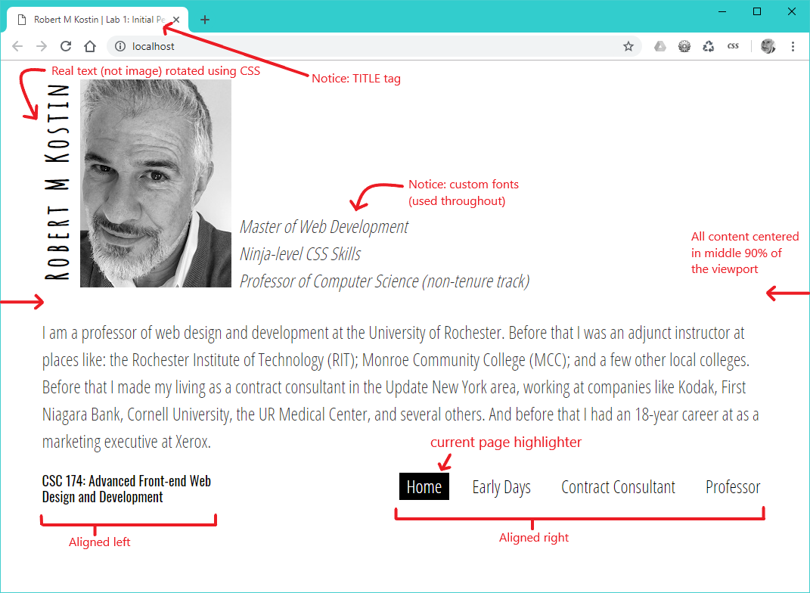

# Lab 1: Initial City Website
*Due: Friday, July 9, 2021*

The goal of this assignment is to simply apply a lot of the basic skills you learned in CSC 170. 

## Requirements

For this assignment, you need to create a small website about a city (or any geographic location where people live) that meets the following requirements.  

- Use the **HTML5** and **CSS3** specifications and make sure **everything validates**, within reason
- At least **four web pages** with a common **navigation element** on each page
- The navigation element must **indicate the current page**
- Some use of **layout**
  - Where appropriate, keep content within 85-95% of the center of the viewport to keep paragraphs of text from growing any more than about 800px wide no matter how wide the viewport gets.
  - Position some elements side-by-side using CSS Grid and/or CSS Flex (just to demonstrate that you can do it)
- Use of some **advanced/fancy styling**; 
  - Demonstrate something/anything to show you are able to implement advanced CSS
  - Example (as shown below) try rotated and positioned text ...but not necessarily that.  There are lots of things you can do. Google for ideas.  (Note: you need to impress other members of the class so you can get a "job" with them.)
  - If you have questions about what exactly constitutes "advanced" or "fancy" or if you need help, leave a message in the #help channel in Slack
- Use of **custom fonts**
  - If you haven't had the pleasure yet, do try [Google Fonts](https://fonts.google.com/); other sources of free custom fonts are available all over the web
- Use of **PHP Includes** to factor-out common elements into separate files
  - At the very least, the NAV element needs to be put into an Include file
- Other requirements: in addition to everything listed above^ all **web standards** and **industry best practices** must be used

*Example:* 

- You can use this for *inspiration*: [csc174.org/lab01/rkostin](http://csc174.org/lab01/rkostin) but beware...
- Do NOT replicate the design of this example website.  You must create something new/custom yourself. 
  - If you use too much of this example website (in terms of HTML structure and/or CSS design) you will lose points for Lab 1.
  - If you're concerned if your website looks too much like the example, ask the professor (post a message in the #help channel)
- Notice: you can FTP-into **lab01** (login credentials below) and navigate to the **rkostin** folder to see how the site is split into multiple *PHP Include* files.  Again, you don't have to replicate that pattern, but feel free to be "inspired" by it.



You can use any solution to highlight the current page, but if need be you can always use [the professor's JavaScript plugin from CSC 170 (ZIP)](menu-highlighter.zip)

### Installation

- You must install the website on the class web server using the following web server credentials, below.

Note: **everyone will use the same FTP account**. Be careful *not* to disturb other students' files!

```
FTP Server (a.k.a. Hostname): ftp.csc174.org
FTP Port: 21
FTP Username: lab01@csc174.org
FTP Password: [see the #announcements channel in Slack]
```

- When you FTP-in to the account, create a folder using your UR NetID (e.g. rkostin) and place your website in there
- Note: do NOT create a folder named "lab01" on the web server.  (That would be redundant.  All the websites using this FTP account are Lab 1 websites.)

## Submit the Assignment

To get credit for your work, submit a link to your website in Blackboard, in the assignment: **Lab 1: Initial City Website**

