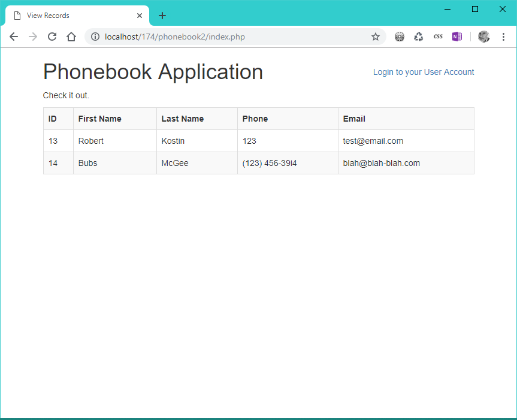
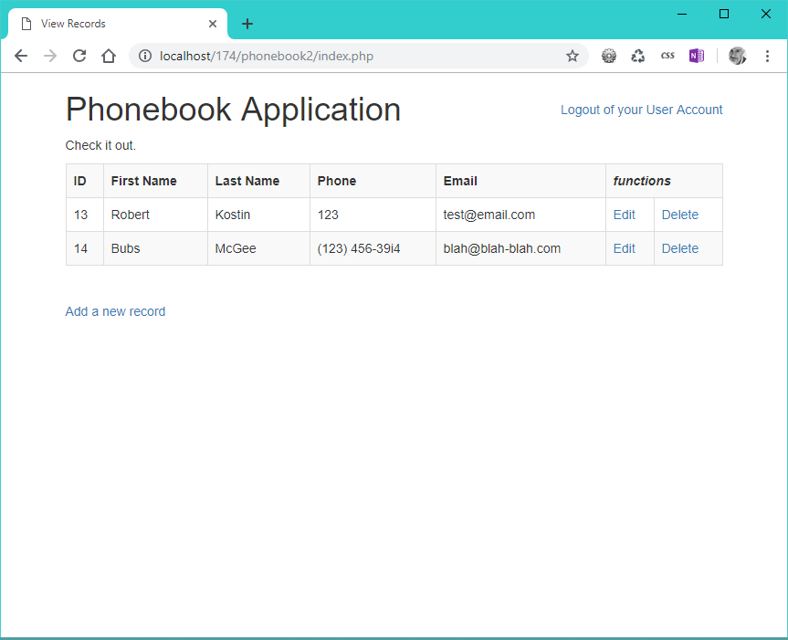

# Lab 12: Secure Login System

*Due: Monday, August 3, 2020* 

**The goal** of this lab is to implement a simple login system

**The purpose** of this lab is practice installing a login system so you can apply it to another website

## Part 1: Follow online tutorial to build the system

The goal here is to *not* blindly copy and paste the code from the tutorial, but actually read and understand how the pieces and parts work together.  You don't have to know exactly what each line of code does (most of it is error handling) but you do need to know what each snippet does from a high level.

- Go to: the [Tutorial Republic: PHP MySQL Login System tutorial](https://www.tutorialrepublic.com/php-tutorial/php-mysql-login-system.php) and follow the instructions
  - Use any database on your own localhost
  - Note: you are expected to know where and how to change the demo code to work with your own development environment (the author assumes you can do that!)
- Test your login system. 

## Part 2: Add a new webpage to your demo

When your login system works as-is from the tutorial, make these changes to prove you understand the system well enough to hack it a little bit.

- **Rename welcome.php** to **index.php**.  (You'll also need to find any reference to "welcome.php" in the code and change that as well.)
- **Create a new webpage** in your login system website - add some content, any content, just so it looks different than the Index page.
- **Link the new webpage** to the index.php page and vice versa so you can go back and forth between the two pages (in effect, a simple, two-page navigation menu)
- **Make the new webpage inaccessible** unless the user is logged-in
  - If the user goes to the new page directly (by URL) it should automatically re-route the user to the login page
- **Add a button, "Sign Out of Your Account"** to the the new webpage - same as the button on the index.php page

## Part 3: Apply what you learned to an existing website

The goal of this part of this lab assignment is to, in effect, merge your phonebook application (from Lab 11) with the login system (Lab 12).

When implemented correctly, users will be able to see the phonebook table (index.php), but the ability to add a new record (add.php), edit a record (edit.php), or delete a record (delete.php) will be password protected.

## Export Your Lab 11 Data

- Go to *phpMyAdmin* on either your **localhost** or login to **Bluehost** and navigate to the *cpanel* and then into *phpMyAdmin*
- Click on the database for your phonebook application (on bluehost, it was called: **urcscon3_lab10**)
- Click on your phonebook table
- Click the **Export** button (top tab bar)
- Click the **Go** button and save the .sql file somewhere handy (like your computer's desktop)

## Create a New Database

- Open your LOCAL *phpMyAdmin*
- Create a new User/Database/Permissions set; you can call the user and database whatever you want (just be consistent - keep in mind that this is for an application that builds-on what you did in Lab 9 for the first version of the "Phonebook Application")
  - remember: you can create the three parts: **user**, **database**, and **permissions**, all at once by going into the User Accounts area of *phpMyAdmin*

- Click on your new database in the left-side panel
- Click the **Import** tab (top tab bar) and select the .sql file from the previous step, and click the **Go** button

- Check to make sure your database table and the data got setup correctly by browsing it in *phpMyAdmin*

## Create a New Set of Website Files

- Working in your *webroot* folder on your computer, copy your **lab11** folder to a new folder, **lab12**

- Edit the **connect-db.php** file; edit the connection information to work with the new database in your localhost that you created in the previous step - change the *server*, *user*, *pass*, and *db* appropriately

- Test the phonebook application in your web browser.  Make sure it continues to work using your local database

## Password Protect Part of the Application

Remember: you need to let users see the phonebook table (index.php), but password-protect the ability to add a new record (add.php), edit a record (edit.php), or delete a record (delete.php).  That means inserting two new pages into the websites Information Architecture: login and register (as well as their helper files and a new table in your database).

- Referring back to the tutorial from Part 1, create the **users** table in your local database (the same database as your phonebook records...
  - You can use the **users.sql** script from the tutorial; just go into phpMyAdmin and click on the lab09 database, then IMPORT (or use the SQL tab to copy and paste the script) to setup the **users** table
  - The goal is to have two tables in your phonebook database: one for the phonebook records, and another for the user accounts.
- Copy the **login.php** file, and **register.php** file from the tutorial to your Lab 12 phonebook folder

**Note: part of merging applications is dealing with inconsistencies between them.** 

- Edit the **login.php** and **register.php** files - notice that their first statement (line 3) refers to **config.php**.  Since the phonebook application uses a file named **connect-db.php** (instead of config.php) edit that line accordingly so the **connect-db.php** file is used

- Open the **config.php** file and the phonebook's **connect-db.php** file.  Notice that, even though they do effectively the same thing, they're coded differently.  
- Generally that doesn't matter, but it just so happens that the tutorial's connection file saves the database connection (in **config.php**) in a variable named **$link** and the Lab 11 phonebook application's connection file saves the database connection (in **connect-db.php**) in a variable named **$connection**.  
- That little inconsistency between applications is normal, and unfortunately must be fixed wherever those variables are used, or else the phonebook application won't work. So...

- Continue editing the **login.php** and **register.php** files in the phonebook application.  Find every instance of the variable **$link** and replace it with **$connection**
  - In **login.php** there are two instances
  - In **register.php** there are three instances

### Password Protect the Webpages that Should be Protected

- From the tutorial's **index.php** file, copy-out the PHP block that sets and then checks the session variable (lines 1 - 10), and paste that PHP block at the top of phonebook2's **new.php**, **edit.php**, and **delete.php** files
  - That'll keep those three files from ever showing unless the user is logged-in
- Edit the **logout.php** file - change the redirection (the header() command on line 12); instead of redirecting the user to **login.php**, change that to **index.php**

### Add "States" to the Webpages for Logged-in vs. Logged-out

- Add a session start command to the top of both the the **index.php** file and the **renderform.php** file like this:<br> `<?php session_start(); ?>`
  - This will allow us to show or hide content in the phonebook2 application based on whether the user is signed-in or not
- In the **index.php** file, add a *login* AND a *logout* link to the top-right of the webpage, just under the opening DIV with the *container* class, like this:

```php+HTML
<div style="float: right; margin-top: 30px;">
<?php if(isset($_SESSION['username'])) { ?>
  <a href="logout.php">Logout of your User Account</a>
<?php } else { ?>
  <a href="login.php">Login to your User Account</a>
<?php } ?>
</div>
```

  - This snipped of code will show *either* the link to *login* or the link to *logout* based on the "state" of the session variable (actually, the existence of the session's global variable "username" being set or not)

*NOTE: that snippet of code is shameful (using in-line styles, and a bastardized float used to position it).  Normally, you would be expected to write appropriate CSS in your external stylesheet, but this assignment is long enough.  Sad.*

Using the same IF statement to check whether the session is active or not, you can disable other features of the **index.php** webpage where it makes sense.

- In the **index.php** file, wrap the link to "Add a new record" with this PHP code:

```php+HTML
<?php if(isset($_SESSION['username'])) { ?>
  <a href="new.php">Add a new record</a>
<?php } ?>
```

That will keep that link from showing unless the user is logged-in.

- In the **index.php** file, wrap the table header that creates the "functions" header for the table using this PHP code:

```php+HTML
<?php if(isset($_SESSION['username'])) { ?>
    <th colspan="2"><em>functions</em></th>
<?php } ?>
```

- And finally, in the **index.php** file, wrap this part of the table using this PHP code:

```php+HTML
<?php if(isset($_SESSION['username'])) { ?>
    <td><a href="edit.php?id=<?php echo $row['id']; ?>">Edit</a></td>
    <td><a onclick="return confirm('Are you sure you want to delete ID: <?php echo $row["id"]; ?>?')" href="delete.php?id=<?php echo $row['id']; ?>">Delete</a></td>
<?php } ?>
```

Those two snippets of code above will keep the "functions" column from appearing in the table unless the user is logged-in.

With the code to control the HTML based on the "state" properly installed, the index page will appear in one of two ways:

1. This, when the user is *not* logged-in:



2. This, when the user *is* logged-in



## Install the Application on the Class Web Server

- The website must be installed on the class web server with a folder name in the pattern of first-initial, last name, e.g. **rkostin**, and put your website files in there
  - Note: the root of the website needs to be the folder you create.  (e.g. **rkostin**) 

### Web Server Credentials

Everyone will use the same FTP account in this class so be careful when you're working on the web server!  Be careful *not* to disturb other students' files.

```
FTP Server (a.k.a. Hostname): ftp.csc174.org
FTP Port: 21
FTP Username: lab12@csc174.org
FTP Password: [same as before]
```

*Notice that the username is different from last time*

- Edit the **config.php** file to work with a database (already created) on the class web server

```sql
'localhost'
'urcscon3_lab12'
'[same as before]'
'urcscon3_lab12'
```

*...NOTE: the database server (the host) is still "localhost"*

## Turn It In

- Go to our CSC 174 section in Blackboard and submit a link to your lab files in the lab assignment named: **Lab 12: Secure Login System**